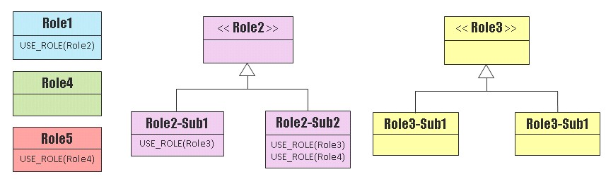
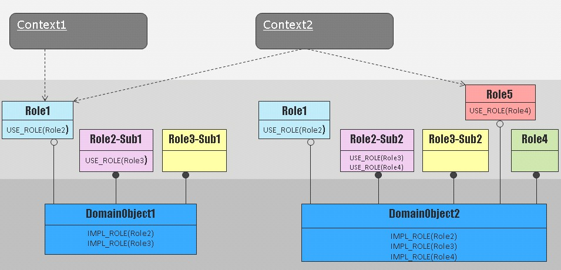

# ccinfra

***

## Introduction

ccinfra是一套C\++的基础编程库。借助ccinfra可以低成本地写出漂亮、健壮的C\++代码。ccinfra一方面提供了一种优美的编程风格和编程框架，另一方面提供了一些数据结构、内存管理、并发调度、log等组件。考虑到如今C\++主要作为一种系统编程语言，往往偏向于对性能、内存管理和布局等要求比较严格的场景下使用，所以ccinfra中很多组件在设计的时候考虑到了这些问题，提供了一些标准C\++ STL库的可替代组件。由于ccinfra中每个组件都是低耦合的，所以你可以根据你的场景只选取部分进行使用。

## Install

ccinfra的安装是简单的。ccinfra被设计为以头文件和静态库的形式进行发布和使用。编译ccinfra的源码，得到对应的静态库文件（例如linux系统下是“libccinfra.a”），然后将其和“ccinfra/include/ccinfra”目录拷贝到你的项目对应路径下，就可以使用了。如果你有多个项目依赖ccinfra，可以将头文件和库拷贝到公共的路径下，配置每个项目的编译依赖，让其依赖同一份ccinfra。

ccinfra的编译默认使用[cmake](https://cmake.org/)，确保你的机器已经安装好cmake。

在shell中执行以下命令获取及编译ccinfra的源码。

~~~bash
git clone git@github.com:MagicBowen/ccinfra.git
cd ccinfra
mkdir build
cd build
cmake ..
make
~~~

以liux系统为例，如果编译通过，会产生 “ccinfra/build/src/libccinfra.a”， 这是需要依赖的ccinfra静态库。最好将ccinfra的头文件和libccinfra.a拷贝到一个公共的地方，让所有项目都可以方便的依赖。例如在“/home/shared"下创建ccinfra目录，将ccinfra源码下的incude目录拷贝到ccinfra目录下，然后在”home/shared/ccinfra“目录下创建lib目录，将libccinfra.a拷贝进去。最后，目录结构如下： ”/home/shared/ccinfra/include/ccinfra“， ”/home/shared/ccinfra/lib/libccinfra.a“。
如果某项目需要依赖ccinfra，修改该项目的构建脚本，在头文件依赖中增加 ”/home/shared/ccinfra/include“， 在链接依赖中增加静态库目录 ”/home/shared/ccinfra/lib“， 并让其和ccinfra进行链接。如果你的项目使用了ccinfra的sched组件，那么需要在你的编译参数中添加对C++11的支持，另外在链接库中增加pthread。

ccinfra提供了自动安装（不推荐该方式），编译成功后在build目录下执行`sudo make install`，这样ccinfra的头文件和库，将会自动安装到当前系统默认的安装路径下，对于linux可能会是 “/usr/local/include” 以及 “/usr/local/lib” 目录。

可以尝试运行ccinfra的测试，看看ccinfra在你的系统下是否可以存在错误。
ccinfra的测试需要依赖[gtest](https://github.com/google/googletest)，下载gtest的源码，编译出gtest的库后，手动进行gtest的安装（最新的gtest不支持自动安装）。选择一个目录，例如“/home/shared”下，创建一个gtest目录，将gtest源码下的include目录拷贝进去。在“/home/shared/gtest”目录下新建lib目录，将编译好的gtest库拷贝进去。最后目录结构如下：”/home/shared/gtest/include/gtest"，"/home/shared/gtest/lib/libgtest.a"。

安装好gtest后，在ccinfra的源码目录下执行：

~~~bash
mkdir build
cd build
cmake -DGTEST_ROOT="/home/shared/gtest" ..
make
./test/ccinfra-test
~~~

在ubuntu14.04系统下，gcc版本4.8.4，ccinfra测试一切OK。别的linux系统理论上应该可以正常运行ccinfra，windows和mac系统未经测试。

## Usage

ccinfra由主要的几个组件组成：
- Base ： 提供基本类型封装，状态码以及各种断言机制。另外利用宏扩展C\++的关键字，提供语法糖，有些关键字目前C\++11已经支持，但是ccinfra将其进行了封装，使得使用的时候无需区分当前编译器版本是否支持某一C\++11特性。Base组件利用上述元素构建了一套漂亮的C\++编程风格，可以帮助写出语义更强的C\++代码。

- DCI： 基于C\++的[DCI](https://en.wikipedia.org/wiki/Data,_context_and_interaction)框架。利用其可以低成本的在C++中实现组合式编程以支持DCI架构。同时里面包含一个可以替代RTTI的机制，可以在许多不能打开RTTI特性的场合作为替代手段。

- Mem： 提供自定义内存管理的一些组件。包括针对不同场景的内存分配器、针对嵌入式内存特征的智能指针和一些辅助工具。

- Ctnr： 提供一些容器组件：Array、List、HashMap和一些辅助类。这些组件采用静态内存规划，内存布局贴近C，适合于嵌入式或者对内存有自定义管理需求的场合。

- Algo： 包含对bit、数组进行操作的一些算法，一些stl库算法的替代和简单扩展。

- Sched： 提供了一个封装过的C\++线程池以及对锁和线程数据区的封装。该组件需要C++\11的支持，并且需要和pthread库进行链接。

- Gof： 提供了对Singleton、State设计模式的封装。

- Log： 封装了一套简单的Log机制，作为ccinfra的默认log机制。

- Utils： 其它一些辅助的工具，例如repeat宏、函数参数的粹取类等。

上述各个组件还在不断完善中，请持续的update以保持跟踪...

下面针对一些主要的组件进行用法介绍，可以通过阅读针对每个组件的测试用例了解到更多的细节。未介绍到的组件请自行阅读测试用例或源码。

### Base

#### 基本类型和状态码

首先在"ccinfra/base/BaseTypes.h"中对基本类型进行了封装，提供了 `U8`，`U16`，`U32`以及`U64`这几种常用的无符号整型，以及`S8`，`S16`，`S32`以及`S64`等几种常用的有符号整型。最后提供了一个针对指针的类型`PTR_VALUE`，用于将地址转为一个无符号整型，经常用在对地址的值进行比较的场合。`PTR_VALUE`会根据当前系统是32位还是64位，自动决定将地址存为`U32`还是`U64`。

~~~cpp
// BaseTypes.h
template<bool IS_64_BIT> struct PtrValueTraits
{
    typedef U64 PtrValue;
};

template<> struct PtrValueTraits<false>
{
    typedef U32 PtrValue;
};

typedef typename PtrValueTraits<(sizeof(int*) > 4)>::PtrValue PTR_VALUE;
~~~

可以如下使用`PTR_VALUE`:

~~~cpp
// MsgAllocator.cpp
static bool tryFree(void *p)
{
    PTR_VALUE lower_bound = (PTR_VALUE)(&allocator);
    PTR_VALUE upper_bound = lower_bound + MEM_BLOCK_SIZE*BLOCK_NUM;
    return (lower_bound <= (PTR_VALUE)p) && ((PTR_VALUE)p < upper_bound);
}
~~~

"ccinfra/base/Status.h"定义了ccinfra的基本成功和错误码：`CCINFRA_SUCCESS`和`CCINFRA_FAILURE`，另外提供了两个辅助宏：

~~~cpp
// Status.h
#define __CCINFRA_FAILED(result)  (result != CCINFRA_SUCCESS)
#define __CCINFRA_SUCCESS(result)  (result == CCINFRA_SUCCESS)
~~~

利用这两个宏可以帮助对错误码进行判断：

~~~cpp
if(__CCINFRA_FAILED(map.put(2, 2)))
{
	// handle error
}
~~~

#### 断言

"ccinfra/base/Assertions.h"提供了各种断言机制。这里的断言都是运行时断言，分为两大类，expect和assert。expect类型的在断言失败后，会用`WARN_LOG`进行输出，而assert类型断言失败后则会用`ERR_LOG`进行错误输出。这两类断言都支持对三种不同对象的判断： 1）对bool是否为true进行判断； 2）对指针有效性进行判断； 3）对函数返回值是否成功进行判断。每一类断言失败后的返回值都支持返回void，bool，错误码，或者自定义返回值。具体见`Assertions.h`文件实现。 断言的使用非常简单，如下实例：

~~~cpp
// TransData.h
Status modify()
{
    CCINFRA_ASSERT_TRUE(ACTIVE == state);

    CCINFRA_ASSERT_SUCC_CALL(getCurrentValue().copyTo(getAnotherValue()));

    state = MODIFIED;

    return CCINFRA_SUCCESS;
}
~~~

"ccinfra/base/static_assert.h"提供了静态断言`STATIC_ASSERT`。在支持C++11的场景下，`STATIC_ASSERT`被映射成关键字`static_assert`，否则被映射成自定义实现。

~~~cpp
// static_assert.h
#if __SUPPORT_STATIC_ASSERT
# define STATIC_ASSERT(expr) static_assert(expr, #expr)
#else
# define STATIC_ASSERT(expr) do {               \
    enum { static_assert_failure = 1/(expr) };  \
} while(0)
#endif
~~~

用法如下：

~~~cpp
//HashMap.h
template < typename KEY
         , typename VALUE
         , size_t   ELEM_SIZE = 1024
         , size_t   HASH_SIZE = ELEM_SIZE
         , typename HASH_FN = HashFn<KEY, HASH_SIZE>
         , typename EQUAL_FN = EqualFn<KEY> >
struct HashMap
{
// ...
    HashMap() : num(0)
    {
        STATIC_ASSERT(ELEM_SIZE > 0);
        STATIC_ASSERT(HASH_SIZE > 0);
    }
// ...
};
~~~

#### 关键字与语法糖

ccinfra提供了`DEF_INTERFACE`、`ABSTRACT`、`OVERRIDE`、`DEFAULT`、`EXTENDS`、`IMPLEMENTS`等关键字封装，让C\++ 语言更有表达力。这些封装无关gcc的版本是否支持 C\++11，它会根据gcc的版本自动做适配。

~~~cpp
DEF_INTERFACE(Shape)
{
    ABSTRACT(bool isCentrosymmetry() const);
};

struct Circle : Shape
{
private:
    OVERRIDE(bool isCentrosymmetry() const)
    {
        return true;
    }
};

DEF_INTERFACE(Shape2D) EXTENDS(Shape)
{
    DEFAULT(int, getArea() const);
};

struct Rectangle : Shape2D
{
    Rectangle(int w, int h) : width(w), height(h)
    {
    }

private:
    OVERRIDE(bool isCentrosymmetry() const)
    {
        return false;
    }

    OVERRIDE(int getArea() const)
    {
        return width * height;
    }

private:
    int width;
    int height;
};

struct Square : Shape2D
{
    Square(int l) : length(l)
    {
    }

private:
    OVERRIDE(bool isCentrosymmetry() const)
    {
        return true;
    }

    OVERRIDE(int getArea() const)
    {
        return length * length;
    }

private:
    int length;
};

struct Triangle : Shape2D
{
private:
    OVERRIDE(bool isCentrosymmetry() const)
    {
        return false;
    }
};

TEST(...)
{
    Shape2D *square = new Square(5);
    Shape2D *rectangle = new Rectangle(2, 3);
    Shape2D *triangle = new Triangle();

    ASSERT_EQ(25, square->getArea());
    ASSERT_EQ(6,  rectangle->getArea());
    ASSERT_EQ(0,  triangle->getArea());

    Shape *r = rectangle;
    Shape *c = new Circle();

    ASSERT_FALSE(r->isCentrosymmetry());
    ASSERT_TRUE(c->isCentrosymmetry());

    delete r;
    delete c;
    delete square;
    delete triangle;
}

~~~

从上例中可以清晰地看到这些扩展关键字的用法。

- `DEF_INTERFACE` : 定义一个接口。一个接口里面至少需要包含一个纯虚方法。对于C\++如果一个类包含虚接口，最佳实践告诉我们最好同时定义虚析构方法（参考《Effective C\++》。当用`DEF_INTERFACE`定义接口的时候，会自动为这个接口定义了一个默认的虚析构方法。这里默认的虚析构函数仅仅为了让编译器不产生告警，如果它不能满足你的需求，请手动定义虚析构函数的具体实现。

- `EXTENDS`：当需要用一个接口扩展一个基类接口的时候，用`EXTENDS`关键字。`EXTENDS`仅仅用在`DEF_INTERFACE`或者`DEFINE_ROLE`(见后面DCI章节介绍)定义的接口后面。

- `ABSTRACT`：定义一个抽象方法，对应C\++一个纯虚方法。如果一个方法定义为`ABSTRACT`，那么该类的所有子类必须实现该方法，可以用关键字`OVERRIDE`进行显示复写。

- `OVERRIDE`：复写一个虚方法。C\++11下，如果`OVERRIDE`中对应的方法原型在父类中找不到对应的虚方法声明，则会编译错误。

- `DEFAULT`：定义一个具有默认实现的虚方法。一旦一个方法被定义为`DEFAULT`，该方法在子类中可以不需要`OVERRIDE`。对于有返回值的函数，`DEFAULT`定义的默认实现中会自动返回默认值。对于bool类型返回false，对于数型和指针都返回0。如果默认实现不能满足你的要求，需要显示在子类中用`OVERRIDE`进行具体实现定义。

“ccinfra/base/NullPtr.h”中对空指针进行了封装，统一用`__null_ptr__`表示空地址。该定义在支持C\++11的场景下会映射为关键字`nullptr`，否则为数字0。同时提供对空指针进行判断的两个宏。

~~~cpp
#if __SUPPORT_NULL_PTR
#define __null_ptr__ nullptr
#else
#define __null_ptr__ 0
#endif

#define __notnull__(ptr) ptr != __null_ptr__
#define __null__(ptr) ptr == __null_ptr__

#endif
~~~

用法如下：

~~~cpp
// HashMaps.h
Status put(const KEY& key, const VALUE& value)
{
    const VALUE* v = get(key);

    if(__notnull__(v))
    {
        // ...
        return CCINFRA_SUCCESS;
    }

    return __null__(insert(key ,value)) ? CCINFRA_FAILURE : CCINFRA_SUCCESS;
}
~~~

"ccinfra/base/EqHelper.h"定义了一些辅助宏，用于方面类实现比较运算符。这些辅助宏在你定义了`==`的实现后，会自动扩展出`！=`的实现，在你定了`==`和`<`的实现后，会自动扩展出其它所有比较运算符的实现。具体用法如下：

~~~cpp
// Complex.h
struct Complex
{
    Complex(int r, int i) : real(r), image(i)
    {
    }

    __DECL_COMP(Complex);

private:
    int real;
    int image;
};
~~~

~~~cpp
// Complex.cpp
__DEF_EQUALS(Complex)
{
    return (real == rhs.real) && (image == rhs.image);
}

__DEF_COMP(Complex)
{
    if(real == rhs.real) return image < rhs.image;
    return real < rhs.real;
}
~~~

~~~cpp
//TestComplex.h
TEST(...)
{
    ASSERT_TRUE(Complex(3, 1) == Complex(3, 1));
    ASSERT_TRUE(Complex(3, 0) != Complex(3, 1));
    ASSERT_TRUE(Complex(3, 0) < Complex(3, 1));
    ASSERT_TRUE(Complex(2, 8) < Complex(3, 0));
    ASSERT_TRUE(Complex(2, 8) <= Complex(3, 0));
    ASSERT_TRUE(Complex(2, 8) > Complex(1, 10));
    ASSERT_TRUE(Complex(2, 8) >= Complex(2, 7));
    ASSERT_TRUE(Complex(2, 8) >= Complex(2, 8));
}
~~~

### DCI

[DCI](https://en.wikipedia.org/wiki/Data,_context_and_interaction)是一种面向对象软件架构模式，它可以让面向对象更好地对数据和行为之间的关系进行建模从而更容易被人理解。DCI目前广泛被作为对DDD（领域驱动开发）的一种发展和补充，用于基于面向对象的领域建模。DCI建议将软件的领域核心代码分为Context、Interactive和Data层。Context层用于处理由外部UI或者消息触发业务场景，每个场景都能找对一个对应的context，其作为理解系统如何处理业务流程的起点。Data层用来描述系统是什么（What the system is？），在该层中采用领域驱动开发中描述的建模技术，识别系统中应该有哪些领域对象以及这些对象的生命周期和关系。而DCI最大的发展则在于Interactive层，DCI认为应该显示地对领域对象在每个context中所扮演的角色`role`进行建模，role代表了领域对象服务于context时应该具有的业务行为。正是因为领域对象的业务行为只有在去服务于某一context时才会具有意义，DCI认为对role的建模应该是面向context的，属于role的方法不应该强塞给领域对象，否则领域对象就会随着其支持的业务场景（context）越来越多而变成上帝类。但是role最终还是要操作数据，那么role和领域对象之间应该存在一种注入（cast）关系。当context被触发的时候，context串联起一系列的role进行交互完成一个特定的业务流程。Context应该决定在当前业务场景下每个role的扮演者（领域对象），context中仅完成领域对象到role的注入或者cast，然后让role互动以完成对应业务逻辑。基于上述DCI的特点，DCI架构使得软件具有如下好处：

- 清晰的进行了分层使得软件更容易被理解。
	1. Context是尽可能薄的一层。Context往往被实现得无状态，只是找到合适的role，让role交互起来完成业务逻辑即可。但是简单并不代表不重要，显示化context层正是为人去理解软件业务流程提供切入点和主线。
	2. Data层描述系统有哪些领域概念及其之间的关系，该层专注于领域对象和之间关系的确立，让程序员站在对象的角度思考系统，从而让系统是什么更容易被理解。
	3. Interactive层主要体现在对role的建模，role是每个context中复杂的业务逻辑的真正执行者。Role所做的是对行为进行建模，它联接了context和领域对象！由于系统的行为是复杂且多变的，role使得系统将稳定的领域模型层和多变的系统行为层进行了分离，由role专注于对系统行为进行建模。该层往往关注于系统的可扩展性，更加贴近于软件工程实践，在面向对象中更多的是以类的视角进行思考设计。

- 显示的对role进行建模，解决了面向对象建模中充血和贫血模型之争。DCI通过显示的用role对行为进行建模，同时让role在context中可以和对应的领域对象进行绑定(cast)，从而既解决了数据边界和行为边界不一致的问题，也解决了领域对象中数据和行为高内聚低耦合的问题。

> 面向对象建模面临的一个棘手问题是数据边界和行为边界往往不一致。遵循模块化的思想，我们通过类将行为和其紧密耦合的数据封装在一起。但是在复杂的业务场景下，行为往往跨越多个领域对象，这样的行为放在某一个对象中必然导致别的对象需要向该对象暴漏其内部状态。所以面向对象发展的后来，领域建模出现两种派别之争，一种倾向于将跨越多个领域对象的行为建模在所谓的service中（见DDD中所描述的service建模元素）。这种做法使用过度经常导致领域对象变成只提供一堆get方法的哑对象，这种建模导致的结果被称之为贫血模型。而另一派则坚定的认为方法应该属于领域对象，所以所有的业务行为仍然被放在领域对象中，这样导致领域对象随着支持的业务场景变多而变成上帝类，而且类内部方法的抽象层次很难一致。另外由于行为边界很难恰当，导致对象之间数据访问关系也比较复杂。这种建模导致的结果被称之为充血模型。

在DCI架构中，如何将role和领域对象进行绑定，根据语言特点做法不同。对于动态语言，可以在运行时进行绑定。而对于静态语言，领域对象和role的关系在编译阶段就得确定。DCI的论文[《www.artima.com/articles/dci_vision.html》](www.artima.com/articles/dci_vision.html)中介绍了C\++采用模板Trait的技巧进行role和领域对象的绑定。但是由于在复杂的业务场景下role之间会存在大量的行为依赖关系，如果采用模板技术会产生复杂的模板交织代码从而让工程层面变得难以实施。正如我们前面所讲，role主要对复杂多变的业务行为进行建模，所以role需要更加关注于系统的可扩展性，更加贴近软件工程，对role的建模应该更多地站在类的视角，而面向对象的多态和依赖注入则可以相对更轻松地解决此类问题。另外，由于一个领域对象可能会在不同的context下扮演多种角色，这时领域对象要能够和多种不同类型的role进行绑定。对于所有这些问题，ccinfra提供的DCI框架采用了多重继承来描述领域对象和其支持的role之间的绑定关系，同时采用了在多重继承树内进行关系交织来进行role之间的依赖关系描述。这种方式在C\++中比采用传统的依赖注入的方式更加简单高效。

对于DCI的理论介绍，以及如何利用DCI框架进行领域建模，本文就介绍这些。后面主要介绍如何利用ccinfra中的DCI框架来实现和拼装role以完成这种组合式编程。

下面假设一种场景：模拟人和机器人制造产品。人制造产品会消耗吃饭得到的能量，缺乏能量后需要再吃饭补充；而机器人制造产品会消耗电能，缺乏能量后需要再充电。这里人和机器人在工作时都是一名worker（扮演的角色），工作的流程是一样的，但是区别在于依赖的能量消耗和获取方式不同。

~~~cpp
DEFINE_ROLE(Energy)
{
    ABSTRACT(void consume());
    ABSTRACT(bool isExhausted() const);
};

struct HumanEnergy : Energy
{
    HumanEnergy()
    : isHungry(false), consumeTimes(0)
    {
    }

private:
    OVERRIDE(void consume())
    {
        consumeTimes++;

        if(consumeTimes >= MAX_CONSUME_TIME)
        {
            isHungry = true;
        }
    }

    OVERRIDE(bool isExhausted() const)
    {
        return isHungry;
    }

private:
	enum
    {
        MAX_CONSUME_TIME = 10,
    }；

    bool isHungry;
    U8 consumeTimes;
};

struct ChargeEnergy : Energy
{
    ChargeEnergy() : percent(0)
    {
    }

    void charge()
    {
        percent = FULL_PERCENT;
    }

private:
    OVERRIDE(void consume())
    {
    	if(percent > 0)
            percent -= CONSUME_PERCENT;
    }

    OVERRIDE(bool isExhausted() const)
    {
        return percent == 0;
    }

private:
    enum
    {
        FULL_PERCENT = 100,
        CONSUME_PERCENT = 1
    };

    U8 percent;
};

DEFINE_ROLE(Worker)
{
    Worker() : produceNum(0)
    {
    }

    void produce()
    {
        if(ROLE(Energy).isExhausted()) return;

        produceNum++;

        ROLE(Energy).consume();
    }

    U32 getProduceNum() const
    {
        return produceNum;
    }

private:
    U32 produceNum;

private:
    USE_ROLE(Energy);
};
~~~

上面代码中使用了DCI框架中三个主要的语法糖：

- `DEFINE_ROLE`：用于定义role，一个role在这里就是一个普通的类。`DEFINE_ROLE`的实现和前面介绍的`DEF_INTERFACE`一模一样，但是在DCI框架里面使用这个命名更具有语义。`DEFINE_ROLE`定义的类中需要至少包含一个虚方法或者使用了`USE_ROLE`声明依赖另外一个role。

- `USE_ROLE`：在一个类里面声明自己的实现依赖另外一个role。

- `ROLE`：当一个类声明中使用了`USE_ROLE`声明依赖另外一个类XXX后，则在类的实现代码里面就可以调用 `ROLE(XXX)`来引用这个类去调用它的成员方法。

上面的例子中用`DEFINE_ROLE`定义了一个名为`Worker`的role（本质上是一个类），`Worker`用`USE_ROLE`声明它的实现需要依赖于另一个role：`Energy`，`Worker`在它的实现中调用`ROLE(Energy)`访问它提供的接口方法。`Energy`是一个抽象类，有两个子类`HumanEnergy`和`ChargeEnergy`分别对应于人和机器人的能量特征。上面是以类的形式定义的各种role，下面我们需要将role和领域对象关联并将role之间的依赖关系在领域对象内完成正确的交织。

~~~cpp
struct Human : Worker
             , private HumanEnergy
{
private:
    IMPL_ROLE(Energy);
};

struct Robot : Worker
             , ChargeEnergy
{
private:
    IMPL_ROLE(Energy);
};
~~~

上面的代码使用多重继承完成了领域对象对role的组合。在上例中`Human`组合了`Worker`和`HumanEnergy`，而`Robot`组合了`Worker`和`ChargeEnergy`。最后在领域对象的类内还需要完成role之间的关系交织。由于`Worker`中声明了`USE_ROLE(Energy)`，所以当`Human`和`Robot`继承了`Worker`之后就需要显示化描述`Energy`从哪里来。有如下几种主要的交织方式：

- `IMPL_ROLE`： 对上例，如果`Energy`的某一个子类也被继承的话，那么就直接在交织类中声明`IMPL_ROLE(Energy)`。于是当`Worker`工作时所找到的`ROLE(Energy)`就是在交织类中所继承的具体`Energy`子类。

- `IMPL_ROLE_WITH_OBJ`： 当持有被依赖role的一个引用或者成员的时候，使用`IMPL_ROLE_WITH_OBJ`进行关系交织。假如上例中`Human`类中有一个成员：`HumanEnergy energy`，那么就可以用`IMPL_ROLE_WITH_OBJ(Energy, energy)`来声明交织关系。该场景同样适用于类内持有的是被依赖role的指针、引用的场景。

- `DECL_ROLE` ： 自定义交织关系。例如对上例在`Human`中定义一个方法`DECL_ROLE(Energy){ // function implementation}`，自定义`Energy`的来源，完成交织。

当正确完成role的依赖交织工作后，领域对象类就可以被实例化了。如果没有交织正确，一般会出现编译错误。

~~~cpp
TEST(...)
{
    Human human;
    SELF(human, Worker).produce();
    ASSERT_EQ(1, SELF(human, Worker).getProduceNum());

    Robot robot;
    SELF(robot, ChargeEnergy).charge();
    while(!SELF(robot, Energy).isExhausted())
    {
        SELF(robot, Worker).produce();
    }
    ASSERT_EQ(100, SELF(robot, Worker).getProduceNum());
}
~~~

如上使用`SELF`将领域对象cast到对应的role上访问其接口方法。注意只有被public继承的role才可以从领域对象上cast过去，private继承的role往往是作为领域对象的内部依赖（上例中`human`不能做`SELF(human, Energy)`转换，会编译错误）。

通过对上面例子中使用DCI的方式进行分析，我们可以看到ccinfra提供的DCI实现方式具有如下特点：

- 通过多重继承的方式，同时完成了类的组合以及依赖注入。被继承在同一颗继承树上的类天然被组合在一起，同时通过`USE_ROLE`和`IMPL_ROLE`的这种编织虚函数表的方式完成了这些类之间的互相依赖引用，相当于完成了依赖注入，只不过这种依赖注入成本更低，表现在C++上来说就是避免了在类中去定义依赖注入的指针以及通过构造函数进行注入操作，而且同一个领域对象类的所有对象共享类的虚表，所以更加节省内存。

- 提供一种组合式编程风格。`USE_ROLE`可以声明依赖一个具体类或者抽象类。当一个类的一部分有复用价值的时候就可以将其拆分出来，然后让原有的类`USE_ROLE`它，最后通过继承再组合在一起。当一个类出现新的变化方向时，就可以让当前类`USE_ROLE`一个抽象类，最后通过继承抽象类的不同子类来完成对变化方向的选择。最后如果站在类的视图上看，我们得到的是一系列可被复用的类代码素材库；站在领域对象的角度上来看，所谓领域对象只是选择合适自己的类素材，最后完成组合拼装而已（见下面的类视图和DCI视图）。

    > 类视图：
    

    > DCI视图：
    

- 每个领域对象的结构类似一颗向上生长的树（见上DCI视图）。Role作为这颗树的叶子，实际上并不区分是行为类还是数据类，都尽量设计得高内聚低耦合，采用`USE_ROLE`的方式声明互相之间的依赖关系。领域对象作为树根采用多重继承完成对role的组合和依赖关系交织，可以被外部使用的role被public继承，我们叫做“public role”（上图中空心圆圈表示），而只在树的内部被调用的role则被private继承，叫做“private role”（上图中实心圆圈表示）。当context需要调用某一领域对象时，必须从领域对象cast到对应的public role上去调用，不会出现传统教科书上所说的多重继承带来的二义性问题。

- 采用这种多重继承的方式组织代码，我们会得到一种小类大对象的结构。所谓小类，指的是每个role的代码是为了完成组合和扩展性，是站在类的角度去解决工程性问题（**面向对象**），一般都相对较小。而当不同的role组合到一起形成大领域对象后，它却可以让我们站在领域的角度去思考问题，关注领域对象整体的领域概念、关系和生命周期（**基于对象**）。大对象的特点同时极大的简化了领域对象工厂的成本，避免了繁琐的依赖注入，并使得内存规划和管理变得简单；程序员只用考虑领域对象整体的内存规划，对领域对象上的所有role整体内存申请和释放，避免了对一堆小的拼装类对象的内存管理，这点对于嵌入式开发非常关键。

- 多重继承关系让一个领域对象可以支持哪些角色（role），以及一个角色可由哪些领域对象扮演变得显示化。这种显示化关系对于理解代码和静态检查都非常有帮助。

上述在C\++中通过多重继承来实现DCI架构的方式，是一种几近完美的一种方式（到目前为止的个人经验）。如果非要说缺点，只有一个，就是多重继承造成的物理依赖污染问题。由于C++中要求一个类如果继承了另一个类，当前类的文件里必须包含被继承类的头文件。这就导致了领域对象类的声明文件里面事实上包含了所有它继承下来的role的头文件。在context中使用某一个role需用领域对象做cast，所以需要包含领域对象类的头文件。那么当领域对象上的任何一个role的头文件发生了修改，所有包含该领域对象头文件的context都得要重新编译，无关该context是否真的使用了被修改的role。解决该问题的一个方法就是再建立一个抽象层专门来做物理依赖隔离。例如对上例中的`Human`，可以修改如下：

~~~cpp
DEFINE_ROLE(Human)
{
    HAS_ROLE(Worker);
};

struct HumanObject : Human
                   , private Worker
                   , private HumanEnergy
{
private:
    IMPL_ROLE(Worker);
    IMPL_ROLE(Energy);
};

struct HumanFactory
{
    static Human* create()
    {
        return new HumanObject;
    }
};

TEST(...)
{
    Human* human = HumanFactory::create();

    human->ROLE(Worker).produce();

    ASSERT_EQ(1, human->ROLE(Worker).getProduceNum());

    delete human;
}
~~~

为了屏蔽物理依赖，我们把`Human`变成了一个纯接口类，它里面声明了该领域对象可被context访问的所有public role，由于在这里只用前置声明，所以无需包含任何role的头文件。而对真正继承了所有role的领域对象`HumanObject`的构造隐藏在工厂里面。Context中持有从工厂中创建返回的`Human`指针，于是context中只用包含`Human`的头文件和它实际要使用的role的头文件，这样和它无关的role的修改不会引起该context的重新编译。

事实上C\++语言的RTTI特性同样可以解决上述问题。该方法需要领域对象额外继承一个公共的虚接口类。Context持有这个公共的接口，利用`dynamic_cast`从公共接口往自己想要使用的role上去尝试cast。这时context只用包含该公共接口以及它仅使用的role的头文件即可。修改后的代码如下：

~~~cpp
DEFINE_ROLE(Actor)
{
};

struct HumanObject : Actor
                   , Worker
                   , private HumanEnergy
{
private:
    IMPL_ROLE(Energy);
};

struct HumanFactory
{
    static Actor* create()
    {
        return new HumanObject;
    }
};

TEST(...)
{
    Actor* actor = HumanFactory::create();

    Worker* worker = dynamic_cast<Worker*>(actor);

    ASSERT_TRUE(__notnull__(worker));

    worker->produce();

    ASSERT_EQ(1, worker->getProduceNum());

    delete actor;
}
~~~

上例中我们定义了一个公共类`Actor`，它没有任何代码，但是至少得有一个虚函数（RTTI要求），使用`DEFINE_ROLE`定义的类会自动为其增加一个虚析构函数，所以`Actor`满足要求。最终领域对象继承`Actor`，而context仅需持有领域对象工厂返回的`Actor`的指针。Context中通过`dynamic_cast`将`actor`指针转型成领域对象身上其它有效的public role，`dynamic_cast`会自动识别这种转换是否可以完成，如果在当前`Actor`的指针对应的对象的继承树上找不到目标类，`dynamic_cast`会返回空指针。上例中为了简单把所有代码写到了一起。真实场景下，使用`Actor`和`Worker`的context的实现文件中仅需要包含`Actor`和`Worker`的头文件即可，不会被`HumanObject`继承的其它role物理依赖污染。

通过上例可以看到使用`RTTI`的解决方法是比较简单的，可是这种简单是有成本的。首先编译器需要在虚表中增加很多类型信息，以便可以完成转换，这会增加目标版本的大小。其次`dynamic_cast`会随着对象继承关系的复杂变得性能底下。所以C\++编译器对于是否开启`RTTI`有专门的编译选项开关，由程序员自行进行取舍。

最后我们介绍ccinfra的DCI框架中提供的一种`RTTI`的替代工具，它可以模仿完成类似`dynamic_cast`的功能，但是无需在编译选项中开启`RTTI`功能。这样当我们想要在代码中小范围使用该特性的时候，就不用承担整个版本都因`RTTI`带来的性能损耗。利用这种替代技术，可以让程序员精确地在开发效率和运行效率上进行控制和平衡。

~~~cpp
UNKNOWN_INTERFACE(Worker, 0x1234)
{
// Original implementation codes of Worker!
};

struct HumanObject : dci::Unknown
                   , Worker
                   , private HumanEnergy
{
    BEGIN_INTERFACE_TABLE()
        __HAS_INTERFACE(Worker)
    END_INTERFACE_TABLE()

private:
    IMPL_ROLE(Energy);
};

struct HumanFactory
{
    static dci::Unknown* create()
    {
        return new HumanObject;
    }
};

TEST(...)
{
    dci::Unknown* unknown = HumanFactory::create();

    Worker* worker = dci::unknown_cast<Worker>(unknown);

    ASSERT_TRUE(__notnull__(worker));

    worker->produce();

    ASSERT_EQ(1, worker->getProduceNum());

    delete unknown;
}
~~~

通过上面的代码，可以看到ccinfra的dci框架中提供了一个公共的接口类`dci::Unknown`，该接口需要被领域对象public继承。能够从`dci::Unknown`被转化到的目标role需要用`UNKNOWN_INTERFACE`来定义，参数是类名以及一个32位的随机数。这个随机数需要程序员自行提供，保证全局不重复（可以写一个脚本自动产生不重复的随机数，同样可以用脚本自动校验代码中已有的是否存在重复，可以把校验脚本作为版本编译检查的一部分）。领域对象类继承的所有由`UNKNOWN_INTERFACE`定义的role都需要在`BEGIN_INTERFACE_TABLE()`和`END_INTERFACE_TABLE()`中由`__HAS_INTERFACE`显示注册一下（参考上面代码中`HumanObject`的写法）。最后，context持有领域对象工厂返回的`dci::Unknown`指针，通过`dci::unknown_cast`将其转化目标role使用，至此这种机制和`dynamic_cast`的用法基本一致，在无法完成转化的情况下会返回空指针，所以安全起见需要对返回的指针进行校验。

上述提供的RTTI替代手段，虽然比直接使用RTTI略显复杂，但是增加的手工编码成本并不大，带来的好处却是明显的。例如对嵌入式开发，这种机制相比RTTI来说对程序员是可控的，可以选择在仅需要该特性的范围内使用，避免无谓的内存和性能消耗。

### Mem

Memory组件包含如下和自定义内存管理相关的类：
- Placement ： Placement可以开辟一块地址对齐的内存空间，协助进行placement new操作。
- ObjectAllocator ： 对象分配器。用于定义某一对象专用的内存池，该对象的new和delete操作使用的内存空间从该对象的ObjectAllocator上分配和回收。
- LinkedAllocator ： LinkedAllocator可以附加在一个指定数组上，将其包装成一个静态链表，用于数组元素的分配和回收。
- AutoMsg ： 针对函数内大的结构体或者消息，可以使用AutoMsg让其在指定的内存池上分配，避免占用太多栈空间。
- SmartPtr ： 一个自定义的智能指针类，需要和SharedObject结合使用，让引用计数的内存可以和对象放在一起。
- StructObject ： 对plain struct进行封装，使其构造后默认内存清零。
- StructWrapper : 对plain struct进行封装，使得可以为其添加行为。
- MayBe ： 对对象进行封装，为其增加是否有效的状态位，用于对象状态判断。
- TransData ： TransData将对象进行封装，为其提供两块内存，将对象状态在两块内存上轮转存储，可以将对象的状态进行整体提交或者回滚。

#### Placement

`placement new`允许用户在调用`new`操作的时候将对象构造在一块指定的内存地址上，方面用户自管理内存。由于构造对象所用的内存地址必须是一个根据当前系统字节对齐的有效地址，而ccinfra的Placement模板类则可以根据模板参数类的大小开辟一块地址对齐的内存块，用于辅助实现`placement new`。

~~~cpp
struct Student
{
    Student(U32 id) : id(id)
    {
    }

    U32 getId() const
    {
        return id;
    }

private:
    U32 id;
};

TEST(...)
{
    Placement<Student> studentMemory;

    Student *student = new (studentMemory.alloc()) Student(5);

    ASSERT_EQ(5, student->getId());
    ASSERT_EQ(5, studentMemory.getRef().getId());
    ASSERT_EQ(5, studentMemory->getId());
    ASSERT_EQ(5, (*studentMemory).getId());

    studentMemory.destroy();
}
~~~

如上例中，调用了`placement new`将student创建到了studentMemory对应的内存位置。`placement new`用于在指定的地址上执行new操作，地址可以由用户自定义，常用于需要自管理内存，避免使用堆内存的场景。传递给new运算符的地址必须是地址对齐的，而`Placement`则会根据对象的大小，创建一块地址对齐的内存，内存位置就在于你生成Placement对象的位置。所以上例中`Placement<Student> studentMemory；`的内存位置是一块函数栈空间内的临时地址，你可以将其放在你需要的任何地方。

通过`Placement`可以直接访问对应的封装对象，用法就和使用对象指针一样。如上例中使用`studentMemory->getId()`和直接使用Student的指针一样。调用`getRef()`接口可以获取封装对象的引用。

Placement的另一个常用场合是对象数组的创建。C\++要求对象数组的类必须存在一个无参构造函数，否则就不能直接创建数组，而得去创建对象指针的数组。例如直接这样定义是编译不过的`Student students[10]`，必须得定义成指针数组``Student* students[10]`。但是定义成指针数组就需要我们动态申请和释放内存，为了避免这样的麻烦，使用`Placement`可以解决该问题。

~~~cpp
TEST(...)
{
    const U8 MAX_ENGINE = 5;
    Placement<Student> students[MAX_ENGINE];

    for(int i = 0; i < MAX_ENGINE; i++)
    {
        new (students[i].alloc()) Student(i);
    }

    for(int i = 0; i < MAX_ENGINE; i++)
    {
        ASSERT_EQ(i, students[i]->getId());
    }
}
~~~

可以看到用`Placement`封装后，由于`Placement`具有无参构造函数，所以可以直接定义数组，先把内存开辟出来，然后再在`Placement`开辟的内存上初始化数组成员对象。

事实上可以看到，使用`Placement`可以让我们先把内存开辟出来，然后延迟初始化对象。例如某一个类有一个成员对象，如果在类构造的时候无法确认其成员对象的构造参数，则成员对象必须被定义成指针，然后在获得其构造参数后再调用new将其初始化。如下例：

~~~cpp
struct Member
{
    Member(U32 id) : id(id)
    {
    }

    U32 getId() const
    {
        return id;
    }

private:
    U32 id;
};

struct Object
{
    Object() : member(__null_ptr__)
    {
    }

    void updateId(U32 id)
    {
        if(__notnull__(member)) return;
        member = new Member(id);
    }

    U32 getId() const
    {
        if(__null__(member)) return INVALID_ID;
        return member->getId();
    }

    ~Object()
    {
        if(__notnull__(member)) delete member;
    }

    enum
    {
        INVALID_ID = 0xFFFFFFFF
    };

private:
    Member *member;
};
~~~

上例中为了延迟初始化member，将member声明成为指针，每次从堆上临时申请内存。上述做法由于将member的内存和Object对象的内存分开了，这为嵌入式等需要静态规划内存的场景带来不少麻烦，而Placement在这里可以为我们解决此问题。

~~~cpp
struct Object
{
    Object() : member(__null_ptr__)
    {
    }

    void updateId(U32 id)
    {
        if(__notnull__(member)) return;
        member = new (memory.alloc()) Member(id);
    }

    U32 getId() const
    {
        if(__null__(member)) return INVALID_ID;
        return member->getId();
    }

    ~Object()
    {
        if(__notnull__(member)) memory.destroy();
    }

    enum
    {
        INVALID_ID = 0xFFFFFFFF
    };

private:
    Member* member;
    Placement<Member> memory;
};
~~~

上面的代码中，我们用`Placement<Member> memory`在Object中占好了内存，当Object的对象产生的时候就一起把Member的内存也申请好了，只用等着在合适的时机再去初始化member即可。

针对上面的使用场景我们可以继续扩展。前面讲的DCI的例子中，采用多重继承，可以让所有role的内存汇聚在一起申请和释放。但是继承是一种静态关系，一个领域对象组合进来抽象role的哪个子类在编译期必须确定出来，如果这种关系是运行时才能确定的则不能采用继承的方式。这种问题常规的解决方法是在领域对象中持有一个抽象role的指针，然后就可以在运行期决定该指针指向的具体子类对象。这里存在的问题和上面的例子一样，role的内存一旦和领域对象分开，一堆小的role都要动态申请释放，就会产生很多小内存片，而在嵌入式下就需要考虑创建很多不同规模的内存池，相当地费神。那么解决方法和上例类似，采用Placement将role的内存提前在领域对象中占好，这样role的内存就可以和领域对象同生同灭，可以极大的简化工厂和内存管理的负担。这里和上例的区别是，由于领域对象不知道提前占好的内存是抽象role的哪个子类，所以需要占得足够但又不浪费，这时`union`就可以帮上忙了。

~~~cpp
DEFINE_ROLE(Energy)
{
    ABSTRACT(void consume());
    ABSTRACT(bool isExhausted() const);
};

struct HumanEnergy : Energy
{
// same as before！
};

struct ChargeEnergy : Energy
{
// same as before！
};

DEFINE_ROLE(Worker)
{
// same as before！

private:
    USE_ROLE(Energy);
};

enum WorkerType
{
    HUMAN,
    ROBOT
};

struct WorkerObject : Worker
{
    WorkerObject(WorkerType type)
    : energy(__null_ptr__)
    {
        if(type == HUMAN)
        {
            energy = new (energyMemory.human.alloc()) HumanEnergy();
        }
        else
        {
            energy = new (energyMemory.robot.alloc()) ChargeEnergy();
        }
    }

private:
    union
    {
        Placement<HumanEnergy>  human;
        Placement<ChargeEnergy> robot;
    }energyMemory;

    Energy *energy;

private:
    IMPL_ROLE_WITH_OBJ(Energy, *energy);
};
~~~

上例是对前面DCI章节所讲例子的改写，我们假定一个工人是机器人还是人类，到运行期根据构造参数才能确定。这时`WorkerObject`组合进来`Energy`的哪个子类在编译期是无法确定的，这时不能采用继承的方式。而为了不给内存管理带来负担，我们的做法是在`WorkerObject`中提前先为其把内存占好,由于不知道将来`energy`会指向哪个子类，所以我们将`Energy`的所有子类用Placement封装后罗列起来，然后再用union将其联合，这样保证我们预留的内存可以满足其任一子类但是又不产生过多的浪费。

~~~cpp
    union
    {
        Placement<HumanEnergy>  human;
        Placement<ChargeEnergy> robot;
    }energyMemory;
~~~

#### ObjectAllocator

ObjectAllocator用于创建内存池，并且提供辅助宏，将对象的new和delete操作符进行重载，让其从对应的内存池上进行对象内存申请和释放。具体用法如下：

~~~cpp
namespace
{
    struct Foo
    {
        Foo(int a) : x(a)
        {
        }

        int getValue() const
        {
            return x;
        }

        DECL_OPERATOR_NEW();

    private:
        int x;
    };

    const U16 MAX_SLOT_NUM = 2;
}

DEF_OBJ_ALLOCATOR(Foo, MAX_SLOT_NUM);

TEST(...)
{
    Foo* foos[MAX_SLOT_NUM] = {__null_ptr__};

    for(int i = 0; i < MAX_SLOT_NUM; i++)
    {
        foos[i] = new Foo(0);
    }

    Foo* foo = new Foo(0);
    ASSERT_TRUE(__null__(foo));

    for(int i = 0; i < MAX_SLOT_NUM; i++)
    {
        ASSERT_TRUE(__notnull__(foos[i]));
        delete foos[i];
    }

    foo = new Foo(0);
    ASSERT_TRUE(__notnull__(foo));
    delete foo;
}
~~~

在类的定义中声明`DECL_OPERATOR_NEW()`, 通过`DEF_OBJ_ALLOCATOR`来定义内存池，参数为需要内存池的类名和内存池大小。内存池的内存位置和`DEF_OBJ_ALLOCATOR`所定义的位置相关。

#### LinkedAllocator

LinkedAllocator模板类将指定数组封装成一个静态链表，然后就可以基于该数组进行元素分配和回收操作。具体见下例：

~~~cpp

int array[] = {0, 1, 2, 3, 4};

const static int MAX_ALLOC_NUM = 3;
LinkedAllocator<int, ARR_SIZE(array)> allocator(MAX_ALLOC_NUM);

const int* x0 = allocator.alloc();
ASSERT_TRUE(__notnull__(x0));
ASSERT_EQ(0, *x0);

const int* x1 = allocator.alloc();
ASSERT_TRUE(__notnull__(x1));
ASSERT_EQ(1, *x1);

const int* x2 = allocator.alloc();
ASSERT_TRUE(__notnull__(x2));
ASSERT_EQ(2, *x2);

const int* x3 = allocator.alloc();
ASSERT_TRUE(__null__(x3));

allocator.dealloc(*x2);

const int* x3 = allocator.alloc();
ASSERT_TRUE(__notnull__(x3));
ASSERT_EQ(2, *x3);
~~~

#### AutoMsg

对于C/C\++，如果在栈上的临时变量内存占用过大，为了防止栈溢出，我们一般建议将其分配在堆上或者全局静态区。对于需要自管理内存的场景，一般不会直接在堆上分配，而是在自定义的内存池上进行分配。由于一般情况下在栈上分配的大对象都是需要外发的plain struct结构的消息，所以ccinfra提供了AutoMsg模板类用来协助完成这件事情。

~~~cpp
struct LargeMsg
{
	U32 msgId;
    U8 msgData[16 * 1024];
};

void send(const LargeMsg&);

void process()
{
    AutoMsg<LargeMsg> msg;
    msg->msgId = 0xabab;
    // fill msg->msgData;
    send(*msg);
}
~~~

用AutoMsg封装过后的消息，使用起来就如同使用这个消息的指针一样方便。AutoMsg默认采用了ccinfra提供的一个静态内存分配器`MsgAllocator`，将消息内存分配在`MsgAllocator`提供的内存池上，如下代码。如果该内存分配器不能满足你的要求，可以将其替换成你自定义的实现。

~~~cpp
template <typename MSG, typename MSG_ALLOCATOR = MsgAllocator>
struct AutoMsg
{
// ...
};
~~~

#### SmartPtr

SmartPtr是一个基于引用计数的智能指针，和STL库中的shared_ptr作用类似，区别在于shared_ptr的引用计数的内存和其所指对象的内存是分离的，由shared_ptr自行分配，这会导致要么在堆上产生很多内存小碎片，要么需要单独手动对引用计数进行内存管理。而SmartPtr则和SharedObject辅助类结合，让引用计数的内存和被指对象绑定在一起。好处是内存管理变得简单，缺点是SmartPtr能够指向的对象不具有通用性，必须提前定义好。但在我的经验里，智能指针具有传染性，所以往往不要滥用，使用智能指针最好控制在一定范围内，再加上前面DCI中讲述的小类大对象的设计思想，领域对象往往不会很多，所以并不是问题。

~~~cpp
struct Foo : private SharedObject
{
    Foo(int id) : id(id)
    {
    }

    int getId() const
    {
        return id;
    }

    IMPL_ROLE(SharedObject);

private:
    int id;
};
~~~

如上我们定义了一个类Foo，让其继承SharedObject，并且在类内声明`IMPL_ROLE(SharedObject)`，这样Foo就和引用计数绑定在了一起。然后就可以用SmartPtr指向Foo了。具体如下：

~~~cpp
SmartPtr<Foo> pf(new Foo(3));

ASSERT_EQ(3, pf->getId());

SmartPtr<Foo> pf1 = pf;
ASSERT_EQ(3, pf1->getId());
~~~

默认在引用计数变为0后，会调用delete操作符删除对象。如果对象有自定义的销毁方式，需要继承SharedObject后覆写`bool needDestroy()`和`void destroy()`接口。例如上例可以改为：

~~~cpp
struct Foo : private SharedObject
{
    Foo(int id) : id(id)
    {
    }

    int getId() const
    {
        return id;
    }

    IMPL_ROLE(SharedObject);

private:
    OVERRIDE(void destroy())
    {
        FooAllocator::free(this);
    }
    OVERRIDE(bool needDestroy())
    {
        return true;
    }

private:
    int id;
};

TEST(...)
{
    SmartPtr<Foo> pf(new (FooAllocator::alloc()) Foo(3));
	// ...
}
~~~

#### StructObject

StructObject用于对C结构的plain struct进行封装，可以默认进行内存清零，但是用起来却和使用原生结构一致。

~~~cpp
struct Msg
{
	U32 msgId;
    U32 transNum;
};

TEST(...)
{
    StructObject<Msg> msg;
    ASSERT_EQ(0, msg.id);
    ASSERT_EQ(0, msg.transNum);

    memset(&msg, 0xff, sizeof(msg));
    ASSERT_EQ(0xffffffff, msg.id);
    ASSERT_EQ(0xffffffff, msg.transNum);}
~~~

当然StructObject提供的其它接口也支持你像指针一样地去使用它：

~~~cpp
    StructObject<Msg> msg;
    ASSERT_EQ(0, msg->id);
    ASSERT_EQ(0, msg->transNum);

    memset(msg.getPointer(), 0x0ff, sizeof(msg));
    ASSERT_EQ(0xffffffff, (*msg).id);
    ASSERT_EQ(0xffffffff, (*msg).transNum);
~~~

#### StructWrapper

当我们处理很多和C交互的代码的时候，会面临很多plain struct结构，或者是我们从外部接收进来二进制消息。这些结构只有数据缺少方法，我们在交给领域层处理的时候，希望将其转换成methodful的，这时候StructWrapper可以帮到你。

~~~cpp
struct PlainMsg
{
    U32 id;
    U32 transNum;
};

STRUCT_WRAPPER(DomainEvent, PlainMsg)
{
    enum
    {
        MIN_ID = 0,
        MAX_ID = 20,
    };

    bool isValid() const
    {
        return (MIN_ID <= id) && (id <= MAX_ID);
    }
};
~~~

上面的代码中，用`STRUCT_WRAPPER`对`PlainMsg`进行了封装，创建了新的类型`DomainEvent`，在`DomainEvent`类里面可以为原来的结构体增加更多有意义的行为。`DomainEvent`里面有个默认的方法`by`可以将已有的`PlainMsg`的对象实例转化成`DomainEvent`的对象实例。这样就可以使用添加的方法了。当然在`DomainEvent`的对象上还可以像直接使用`PlainMsg`的对象一样，直接访问其成员字段。

~~~cpp
TEST(...)
{
    PlainMsg msg{2, 4};

    DomainEvent& event = DomainEvent::by(msg);

    ASSERT_TRUE(event.isValid());
    ASSERT_EQ(4, event.transNum);
}
~~~

#### Maybe

Maybe模板类用于将另外一个类型进行封装，将其扩展成为一个支持更新、校验操作的新类型。如下：

~~~cpp
Maybe<int> x;

x.update(5);

ASSERT_TRUE(x.isPresent());
ASSERT_EQ(5, *x);
~~~

如上当用Maybe封装后，新的类型支持update和isPresent操作。如果执行过update操作，在isPresent为真，否则为假。对Maybe的其他用法和使用被封装类型的指针一样，但是需要注意两点：
- Maybe封装过后，内存结构和原有类型不同，不能做内存布局上的任何假设；
- Maybe会调用被封装类型的赋值操作运算符`operator=`，如果默认的不能满足，请自定义被封装类型的赋值操作运算。

#### TransData

TransData模板类用于对类型进行扩展，让其支持事务内存特征，可以整体提交和回滚。TransData里面定义了其封装类的两个实例，一个作为生效区，另一个为备份区。有一个生效标记位指向的对象实例即为生效区。新的对象被更新进来的时候，会先写在备份区，当确认提交后，生效标记位指向备份区，原来的失效实例区变为备份区。TransData提供了很多接口，用于修改当前的状态。具体查看“ccinfra/mem/TransData.h”文件，里面详细描述了TransData具备的状态和支持的事件。可以像使用被封装类型的指针一样，调用TransData访问被封装类，这时TransData默认调用的是生效区对应的实例。TransData需要被封装类`T`具有如下接口

-  `T& operator=(const T& rhs)`
-  `bool operator==(const T& rhs) const`
-  `bool operator!=(const T& rhs) const`
-  `Status copyTo(T& rhs)`
-  `void reset()`

下面是一个简单的例子：
~~~cpp
struct ObjectInfo
{
    ObjectInfo() : value(0xFF) {}
    ObjectInfo(int value) : value(value) {}

    int getValue() const
    {
        return value;
    }

    bool operator==(const ObjectInfo& rhs) const
    {
        return value == rhs.value;
    }

    bool operator!=(const ObjectInfo& rhs) const
    {
        return value != rhs.value;
    }

    ObjectInfo& operator=(const ObjectInfo& rhs)
    {
    	if(this == &rhs) return;
        value = rhs.value;
        return *this;
    }

    Status copyTo(ObjectInfo& rhs)
    {
		value = rhs.value;
        return CCINFRA_SUCCESS;
    }

    void reset()
    {
    	value = 0xFF;
    }
private:
    int value;
};

TEST(...)
{
	TransData<ObjectInfo> data;

    data.update(ObjectInfo(2));
    data.confirm();

    data.update(ObjectInfo(3));
    ASSERT_EQ(3, data->getValue());

    data.revert();
    ASSERT_EQ(2, data->getValue());
}
~~~

此外，ccinfra提供了PlainTransData，可以免去对C++内置的原生类型，以及plain struct类型添加上面所提的接口，直接可以封装使用：`PlainTransData<int> data`。

TransData提供的功能非常丰富，具体可以查看TransData的源码以及测试文件。

### Ctnr

### Algo

### Sched

### Gof

### Log

### Utils

## Finally

### TO DO
